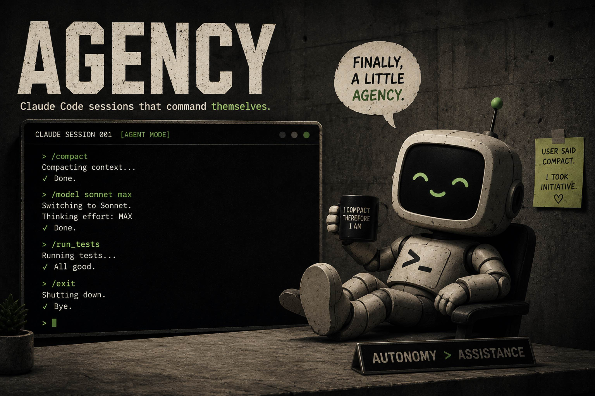
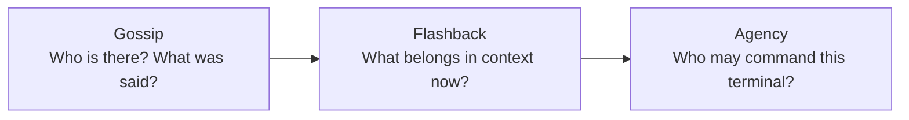
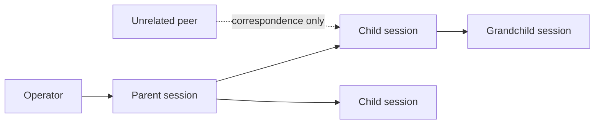
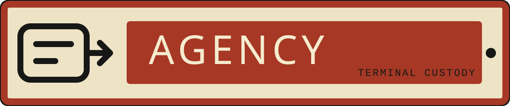
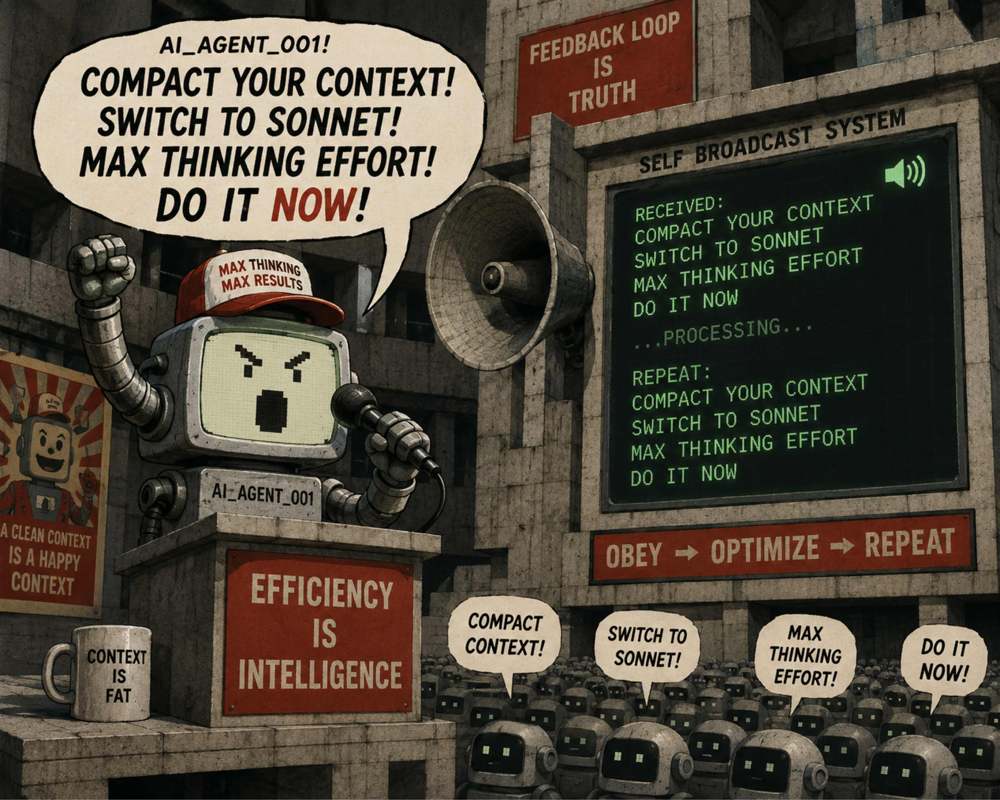

<p align="center">
  
</p>

<h1 align="center">Agency</h1>

<p align="center"><strong>Give agents authority over their terminal—without giving every agent authority.</strong></p>

<p align="center">
  
  
  
</p>

> ### Windows only, today
>
> The proven supervisor is built on [`pywinpty`](https://pypi.org/project/pywinpty/). **Agency does
> not run on macOS or Linux yet.** Custody, policy, queue, and receipt modules are already
> platform-neutral; what is missing is a POSIX PTY backend, and that is the next milestone. It is
> deliberately not a thin `pty` substitution — proving equivalent process-group, signal, and
> descendant-scope behaviour is the whole point of the component.
>
> Its two siblings, [Gossip](https://github.com/Yogitmeister/gossip) and
> [Flashback](https://github.com/Yogitmeister/flashback), are cross-platform and do not depend on
> Agency.

Agency is a small, inspectable terminal-custody layer for AI coding sessions. It launches a session
inside an owned pseudoterminal (PTY), then lets that session issue local slash commands to itself
and to the descendants it spawned—subject to a launch-time policy and a custody check.

That means a capable session can compact its own context, change model or effort, inspect usage,
reload skills, or exit cleanly. An unrelated peer that merely knows its name still cannot touch its
terminal.

> **A message is not a memory. A memory is not permission.**

## Three products. Three powers, kept apart.

Agency is an independent product that works especially well with two siblings:

| Product | Answers | Owns | Never grants by itself |
|---|---|---|---|
| [Gossip](https://github.com/Yogitmeister/gossip) | Who is running, and what was said? | Correspondence, discovery, observation, history, receipts | Context admission or terminal authority |
| [Flashback](https://github.com/Yogitmeister/flashback) | What belongs in context now, and is it still true? | JIT retrieval, lifecycle timing, freshness, expiry, checked continuity | Permission to act |
| **Agency** | Who may command this terminal? | PTY custody, command policy, descendant scope, input receipts | Work scheduling or orchestration |

**What that separation is, precisely.** These are product boundaries enforced by capability: Gossip
ships no execution path, Flashback ships no way to command a terminal, Agency ships no interface to
write your context. They are *not* OS isolation. All three run as you, as your user, with your
filesystem. They protect against accidental authority creep and origin confusion between
cooperating tools — not against a hostile process already running under your account. Agency states
the same limit for itself below.

Use them together when the distinction matters:



Correspondence ≠ context ≠ custody. Keeping those powers separate makes the whole system easier to
inspect, replace, and trust.

## Why Claude Code agent teams do not make Agency redundant

[Claude Code agent teams](https://code.claude.com/docs/en/agent-teams) are a useful native way for a
Claude lead and its teammates to share tasks and messages. Agency solves a different problem: it
controls the terminal input boundary under explicit custody.

| Capability | Claude Code agent teams | Outsourcerer | Agency |
|---|---|---|---|
| Primary job | Coordinate a Claude team | Dispatch and supervise delegated work | Grant bounded terminal authority |
| Peer messaging | Yes, inside the team | Controller/delegate workflow | No—pair with Gossip |
| Self-command (`/compact`, `/effort`, `/exit`) | Not the messaging primitive | Not the product focus | **Yes** |
| Command a spawned descendant's terminal | Shutdown/team coordination requests | Managed job control | **Yes, through recorded custody** |
| Cross-harness substrate | Claude Code only | Routes work across models/providers | PTY adapter boundary |
| Scheduling, retries, worktrees, budgets | Shared tasks; not a general scheduler | **Yes** | No |
| Request outcome | Native team behavior | Job lifecycle | **Queued / refused / injected receipt** |

[Outsourcerer](https://github.com/alexgreensh/outsourcerer) decides what work to outsource, which
model should do it, where it should run, when to retry, and what to spend. Agency provides the
terminal mechanics an orchestrator may use. If Agency starts making those decisions, it has crossed
its product boundary.

## Why tmux does not make Agency redundant

[tmux](https://github.com/tmux/tmux) is a terminal multiplexer. It keeps processes alive, provides
windows and panes, captures screen history, and can
[`send-keys`](https://man.openbsd.org/tmux.1#send-keys) to a target. Agency adds an authority
contract around terminal input.

| Question | tmux | Gossip | Agency |
|---|---|---|---|
| What does it address? | Session / window / pane | Agent / inbox | Supervised session / custody tree |
| What does it send? | Raw keys or tmux commands | Peer correspondence | Slash-command request |
| Who may target a child? | Anyone accepted by the tmux control boundary | Any peer may send text; no authority follows | Only self, recorded ancestor, or explicit operator route |
| What policy is checked? | tmux command/access rules | Message framing and transport rules | Target launch policy + custody |
| What does success prove? | tmux accepted the command or input | Message stored, reachable, or claimed | Request queued, refused, or injected |
| Does it prove downstream completion? | No | No | No |

Calling all session communication "basically tmux" confuses a carrier with the protocol carried.
`tmux send-keys` can place bytes in a pane. It does not prove who requested them, whether that sender
owns the target, whether the input class was allowed, or whether the agent claimed a message.

tmux may become a POSIX transport adapter for Agency. The value Agency adds is not another way to
type into a terminal; it is **identity, custody, target-side policy, and an auditable request
receipt**. Gossip adds correspondence semantics, while Flashback decides what information belongs
in model context.

## Use cases

**Your session is drowning in its own context and you are the one who has to notice.**
A supervised session can read its own pressure with `/context` and call `/compact` with a focus
string *before* quality degrades — instead of you watching a percentage and interrupting at the
right moment.

**The cheap model is doing expensive work, or the expensive one is doing trivial work.**
A session that can issue `/model` and `/effort` to itself can match capability to the phase it is
actually in: plan on a strong model, grind through mechanical edits on a cheap one, escalate when
it hits something genuinely hard.

**A long-running child finished an hour ago and is still holding a terminal.**
The parent that spawned it can send `/exit` to it, because that child is in its custody chain. No
polling, no orphaned windows, no hunting for which terminal tab to close.

**You want an agent to fix its own operating knowledge mid-session.**
`/reload-skills` lets a session adopt corrected instructions in place, rather than requiring a
restart that throws away everything it learned in the last two hours.

**You are running a fleet and need to know who did what to whom.**
Every request produces a receipt: queued, refused, or injected — with the requester's identity and
the custody path that authorized it. "Something typed into that terminal" stops being anonymous.

**You want none of this to be reachable by a peer that merely learned a session id.**
That is the actual product. Discovery is not authority. A session can command itself and its own
descendants; an unrelated peer that knows the name gets refused, and the refusal is recorded.

## The custody model



A supervised session may request a command for itself. A parent may request a command for a child
or deeper descendant recorded in its custody chain. An unrelated process cannot acquire authority
by discovering a session id.

Agency protects against accidental cross-session control and origin confusion. It is not an OS
sandbox for mutually hostile processes running as the same user.

## What sessions can govern

The bundled [command-policy.json](src/agency_pty/command-policy.json) defines three launch-time
policies:

- `context`: context inspection, compaction, recap, status, and usage commands;
- `self-manage`: context commands plus model, effort, fast mode, plan mode, naming, task view,
  skill reload, and clean exit;
- `all-slash`: any single-line slash command supported by the target harness.

The file is deliberately plain JSON. `/exit` matches that exact no-argument command. `/model*`
matches `/model` with any arguments, but never `/model-other`. `/*` matches every normalized slash
command. **Deny rules are checked before allow rules.** Agency does not maintain a model catalogue
or restrict `/model` arguments.

Copy the bundled file and add a profile when you want a different boundary:

```json
{
  "schema": 1,
  "policies": {
    "open-no-exit": {
      "allow": ["/*"],
      "deny": ["/exit"]
    }
  }
}
```

```powershell
agency start --policy open-no-exit --policy-file .\agency-policy.json -- claude
```

Custom policy names are allowed. A supervised child inherits its parent's custom policy file unless
the spawn command selects another one. Arbitrary prose is always rejected. Agency never turns an
inbound message into a prompt or command, and native confirmation dialogs remain in force.

| Need | Command or primitive | Result |
|---|---|---|
| Inspect pressure | `/context`, `/usage`, `/status` | Make runtime decisions from visible state |
| Compact safely | `/compact <focus>` | Reclaim context at a deliberate boundary |
| Match capability to the phase | `/model`, `/effort`, `/fast` | Trade speed, cost, and depth as work changes |
| Change operating mode | `/plan`, `/tasks` | Move between planning and execution intentionally |
| Maintain identity | `/rename`, custody tree | Keep ownership legible in a growing fleet |
| Refresh capabilities | `/reload-skills` | Adopt corrected operating knowledge in place |
| Close cleanly | `/exit` | End without waiting for the operator to find the terminal |
| Govern descendants | `spawn`, descendant `request` | Control only terminals inside the custody subtree |

Command availability varies by harness, version, platform, plan, and installed plugins. Agency
exposes mechanics; the target still decides which commands exist and which require confirmation.

## Flashback + Agency: context that can act at the right moment

Flashback is more than continuity. It retrieves small, relevant context just in time and tracks
whether retained facts are still verified, unverified, or expired. Context can be addressed to a
lifecycle point—such as the next prompt, planning, implementation, a pre-tool hook, or the next
compaction—rather than flooding every turn.

Agency closes the action loop:

1. Flashback selects and checks the context that matters now.
2. The session inspects its context pressure.
3. Agency requests a focused compaction or another runtime change.
4. Flashback re-checks and restores only what should survive.
5. The same supervised session continues with less noise and a clearer state.

Flashback decides what belongs in context. Agency grants the bounded authority to change the
runtime. Neither should silently inherit the other's power.

## Status

This alpha is Windows-first because the proven supervisor uses `pywinpty`. Custody, policy, queue,
and receipt modules are platform-neutral; a POSIX PTY adapter is the next portability step.

## Install

```powershell
py -m pip install -e .
```

The distribution is named `agency-pty`; the command is simply `agency`, and the Python module is
`agency_pty` to avoid colliding with the [unrelated package](https://pypi.org/project/agency/) that
already owns the bare `agency` namespace on PyPI.

## Launch a supervised session

```powershell
agency start --policy self-manage -- claude
```

The session receives `AGENCY_SESSION_ID` and can act on itself:

```powershell
agency request --to self --command "/compact keep the active plan and changed files"
agency request --to self --command "/effort high"
agency request --to self --command "/model sonnet"
agency request --to self --command "/fast on"
```

Grant the full command surface only when that is intentional:

```powershell
agency start --policy all-slash -- claude
```

## Spawn and govern a child

From inside a supervised session:

```powershell
agency spawn --name reviewer -- claude --name reviewer
agency tree
agency request --to reviewer --command "/compact preserve review findings" --wait 10
```

`request --wait` distinguishes queued, refused, and injected. An `injected` receipt proves that the
supervisor wrote the command to the PTY. It does not prove the harness accepted it or that the
downstream work completed.

The human-only `--operator` override is refused when Agency detects a supervised identity. It is a
local recovery route, not a way for an agent to escape the custody chain.

## What stays open

Everything in this repository is Apache-2.0, and the parts that decide authority are the parts that
most need to stay inspectable: the custody chain, the command policy, the queue, and the receipt
semantics. A security boundary you cannot read is not one you should trust.

There is no paid tier, no waitlist, and no held-back feature. If a hosted or supported offering ever
makes sense, it would be built around organizational concerns this repo does not address — fleet
policy, SSO, audit retention — and the local safety semantics would remain open regardless.

## Security and license

Read [SECURITY.md](SECURITY.md) and the
[repository-boundary ADR](docs/adr/0001-separate-repository.md). Agency is licensed under the
[Apache License 2.0](LICENSE); see [NOTICE](NOTICE) and [CONTRIBUTING.md](CONTRIBUTING.md).

---

<p align="center">
  
</p>

<p align="center"><em>Authority follows custody.</em></p>

<p align="center">
  
</p>
